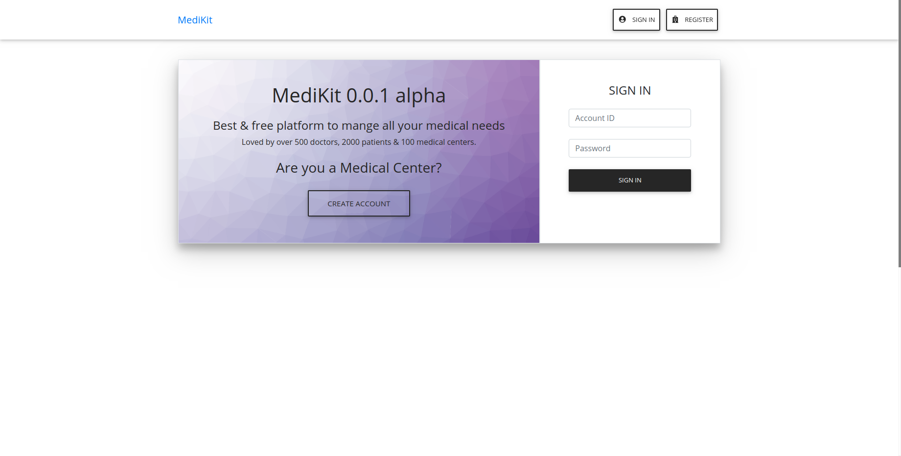
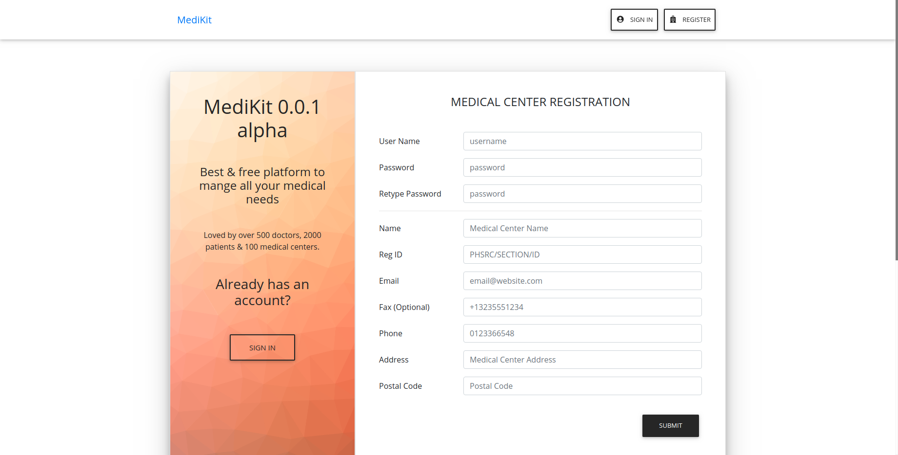

# Pulse Health care Project

## Database Creation and Running Web Project

`Ubuntu` + `intellij IDEA` is preferred to run this project.

1. Install `PHP` and `mysql`. Run 

   ```bash
   sudo apt-get install php
   sudo apt-get install php-pear php-fpm php-dev php-zip php-curl php-xmlrpc php-gd php-mysql php-mbstring php-xml libapache2-mod-php
   
   sudo apt-get install mysql-server
   sudo apt-get install php7.2-mysqli
   sudo mysql
   ```

2. Add `root` user with `root` password.

   ```sql
   ALTER USER 'root'@'localhost' IDENTIFIED WITH mysql_native_password BY 'root';
   ```

3. Run `mysql_secure_installation`. While running `mysql_secure_installation`, don't give `y` to `validate password plugin`.

4. Run `mysql` with the `root` privilege.

   ```bash
   mysql -u root -p
   ```

6. Create the database and user.
   
   ```sql
    CREATE USER 'pulse_root'@'localhost' IDENTIFIED BY 'password';
    CREATE DATABASE pulse;
    USE pulse;
    GRANT ALL PRIVILEGES ON pulse . * TO 'pulse_root'@'localhost';
   ```
   
5. Create the tables. Refer to `web/dump.sql` for database dump.

6. Install composer and run `composer install` from `web/` folder.

8. Run `web/public/` folder from `PHP`.

    ```bash
    cd web/public
    php -S localhost:8000
    ```

9. Navigate to `http://localhost:8000` to verify that everything is working properly.

*For ease of testing we have included all default passwords of users in the table without encrypting. It can be easily removed in production use.*

## Running Tests 🤖

* Unit tests and integration tests for the web site can be found in `web/test` folder. You need to have installed the dependencies using composer before testing.
* Automated selenium tests can be found in `test/selenium` directory. You have to have installed,

1. Python 3.7
2. Selenium library for python (`pip install selenium`)
3. Chrome web driver
   1. `sudo apt-get install chromium-chromedriver`
   2. If you get a `SessionNotCreatedException: session not created: Chrome version must be between 70 and 73` or a similar message, go to http://chromedriver.chromium.org/ and download chrome driver matching your chrome browser version.
   3. Replace the `chromedriver` file in `/usr/bin/chromedriver` with the downloaded file.
4. Run `python main.py`

## Running App

To run the app, your web site must be functioning correctly. Run web in `https://localhost:8000`. **Currently app only works in an emulator because web is deployed in localhost and not in a real web server.** You need to have flutter 1.5 installed and working correctly in order to run the app. Run `flutter run` from `app/` directory in order to run the debug version.

## Screenshots 🖼️

|          |  |
| --------------------------------------------------- | ------------------------------------------ |
| **Home Page**                                       | **Login Page**                             |
|  |                                            |
| **Medical Center Registration Page**                |                                            |


## User Management

Current user = `administrator`

Current password = `password`

## Basic TODO

- [x] Implement user login
- [x] Implement medical center account creation
- [x] Implement doctor/patient account creation
- [x] Implement profile viewing
- [x] Implement selecting patient account
- [x] Implement timeline
- [x] Implement medication adding

## Members

>  K. D. Sunera Avinash Chandrasiri
>  T. Anju Chamantha
>  Lahiru Udayanga